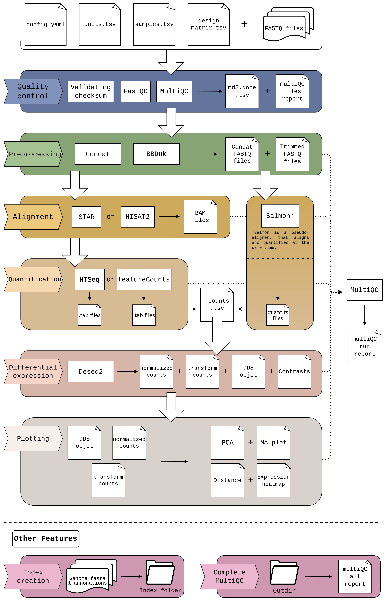

[//]: # ()

# cluster_rnaseq: RNA-seq pipeline.

[Pipeline status](https://gitlab.com/bu_cnio/cluster_rnaseq/commits/master)

## Introduction
**cluster_rnaseq** is a **[Snakemake](https://snakemake.readthedocs.io/en/stable/) pipeline** that performs a comprehensive RNA-seq analysis, covering from the basic steps (QC, alignment, quantification) to the more advanced downstream analyses (diferential expresion). 

The pipeline makes extensive use of Snakemake's integration with the [conda](https://docs.conda.io/en/latest/) package manager, to automatically take care of software requirements and dependencies.

We've built cluster_rnaseq for flexibility, with the aim of allowing the user to adjust the pipeline to different experiments using configuration parameters, including setting the pipeline to align or quantify with different tools.
When in doubt, the default parameters were calculated to offer a good starting configuration.

## Workflow overview

This is a schema of the complete workflow. Certain parts may be skipped depending on input data and chosen configuration.

## Authors
 * Daniel Cerdán-Vélez
 * María José Jiménez-Santos
 * Santiago García-Martín
 
## Setup

The setup of the pipeline consists of the modifying two configuration files, setting the desired parameters and the location of the input/output files; and two other files to know which samples enter the differential expression if it is going to be carried out, and its design matrix. 
A general description of these files follows. See the *Usage* section for more details.

### Configuration files

* **config.yaml** contains all pipeline parameters.
* **units.tsv** contains information on the samples to be analysed and their paths.
* **samples.tsv**: Indicates whether a sample is included in the differential expression.
* **designmatrix.tsv**: Indicates the experimental conditions of each sample.

### Input files

* raw data in gzip compressed FASTQ files

## Usage 

### 1. Set up the environment 

cluster_rnaseq requires the conda package manager in order to work. Please install conda by following the [bioconda installation instructions](http://bioconda.github.io/user/install.html#install-conda). In addition, of course, it is essential to install Snakemake; following the steps in the [Snakemake documentation](https://snakemake.readthedocs.io/en/stable/getting_started/installation.html). 

### 2. Download cluster_rnaseq repository from Gitlab.
Use git clone command to create a local copy. 

    git clone https://gitlab.com/bu_cnio/cluster_rnaseq.git

### 3. Configure the pipeline.

Before executing the pipeline, the users must configure it according to their samples. To do this, they must fill these files:

> TIP: different analysis can be run using just one cloned repository. This is achieved by changing the outdir and logdir in the configuration file. Also different parameters values can be used in the different analysis.

#### **a. config.yaml**

This is the pipeline configuration file, where you can tune all the available parameters to customise your RNAseq analysis. Here the aligner and quantifier to be used are indicated, as well as the necessary input or output file paths and a resource management section for each rule. 

The example file ([template_config.yaml](https://gitlab.com/bu_cnio/cluster_rnaseq/-/blob/master/template_config.yaml)) features extensive inline documentation. Rename it to `config.yaml` to use it during your execution.

#### **b. units.tsv**

This file is used to configure the FASTQ input files.

An example file ([template_units.tsv](https://gitlab.com/bu_cnio/cluster_rnaseq/-/blob/master/template_units.tsv)) is included in the repository.

Rename it to `units.tsv` and edit its contents according to the following table:

| **Field name** 	| **Description**                  |
|------------	|-----------------------------------------------------	|
| **sample**     	| Sample name (must match the sample name specified in *samples.tsv*).         	|
| **lane**       	| Lane identifier from which the samples will be concatenated.|
| **fq1**        	| Path to FASTQ file for read 1.  	|
| **fq2**        	| Path to FASTQ file for read 2.    | 
| **md5_fq1**        	| MD5 hash for the file in 'fq1'.    | 
| **md5_fq2**        	| MD5 hash for the file in 'fq2'.    | 

The first three columns, "sample", "lane" and "fq1", are mandatory and defines the sample name, lane and path for each sample. The other columns are optionals and must be filled is the experiment is paired-end ("fq2") or if you have the MD5 hashes ("md5_fq1" and "md5_fq2"). 

#### **c. samples.tsv**

This table contains the name of each sample and an indication to include it (if diffexp = True) or exclude it (if diffexp = False) from the differential expression analysis. 

An example file ([template_samples.tsv)](https://gitlab.com/bu_cnio/cluster_rnaseq/-/blob/master/template_samples.tsv) is included in the repository. Rename it to `samples.tsv` and edit its contents. 

#### **d. designmatrix.tsv**

This is the table with the experimental conditions of each sample. The control condition must be preceded with an asterisk. Extra columns can be added as batch variables to correct the batch effect.

An example file ([template_designmatrix.tsv)](https://gitlab.com/bu_cnio/cluster_rnaseq/-/blob/master/template_designmatrix.tsv) is included in the repository. Rename it to `designmatrix.tsv` and edit its contents before performing the differential expression. 

### 4. Create the Conda environments.

To run the pipeline, the user needs to create the conda environments first, which will take some minutes.
This step is done automatically using this command:

    snakemake --use-conda --conda-create-envs-only --conda-frontend mamba

### 5. Run the pipeline.

Once the pipeline is configured and conda environments are created, the user just needs to run cluster_rnaseq.

    snakemake --use-conda -j 32 

The mandatory arguments are:
* **--use-conda**: to install and use the conda environemnts.
* **-j**: number of threads/jobs provided to snakemake.

## Pipeline steps

Here you can find a general description of the main steps of the pipeline.

### 1. MD5 check and FASTQ quality control.

#### MD5 check

If MD5 hashes are included in `units.tsv`, the pipeline generates the hashes for your files and compares them with the ones in `units.tsv`; giving a error if they does not match.

#### General QC

cluster_rnaseq implements [FastQC](https://www.bioinformatics.babraham.ac.uk/projects/fastqc/) to check the overal quality of the input FASTQ files. 

#### MultiQC report

cluster_rnaseq creates a Quality Control HTML reports using [MultiQC](https://multiqc.info/docs/). 
This report includes information from FastQC, from both the original files and the complete samples after concatenating them; and also from the rest of tools used in the execution. 

### 2. Concatenation, downsampling & trimming.

Before starting the analysis, the samples are concatenated by their lane, to obtain a complete file for each of the samples.

After this, there is the possibility of standardizing the number of reads of the files by performing a downsampling of the samples. The *downsamplig* parameter of `config.yaml` must be True and the desired number of reads for each sample must be indicated; as well as a seed to control the randomness of the analysys and allow to be replicated.

Finally, trimming is performed to remove the adapters used during sequencing. The [bbduk](https://jgi.doe.gov/data-and-tools/software-tools/bbtools/bb-tools-user-guide/bbduk-guide/) tool, from the [BBTools](https://jgi.doe.gov/data-and-tools/software-tools/bbtools/) package, is used. By default, the file [adapters.fa](https://gitlab.com/bu_cnio/cluster_rnaseq/-/blob/master/resources/trimming/adapters.fa) with different adapters is passed to the tool. 

### 3. Alignment.

There are three different methods to align the reads: STAR, Salmon or HISAT2. You can choose the desired method in `config.yaml`.

[STAR](https://github.com/alexdobin/STAR/blob/master/doc/STARmanual.pdf) and [HISAT2](http://daehwankimlab.github.io/hisat2/manual/) are aligners and require a parameter, defined in the configuration file:

* The corresponding index path, whether it already exists or not

 if the index does not exist, it can be generated through the pipe (explained later) with:
* An annotation file containing the features of interest (in GTF format, must match the target genome)
* A FASTA file with the genome

> STAR alignment is sorted by coordinate internaly, which is necesary for the quatification. HISAT2 is not, so its output is treated with [samtools sort](http://www.htslib.org/doc/samtools-sort.html) to get an equivalent output.

[Salmon](https://salmon.readthedocs.io/en/latest/salmon.html) is a pseudo-aligner that directly returns the counts for each of the samples, so none of the quantization tools in the next step will be used. It require a parameter, defined in the configuration file too:

* The corresponding index path, whether it already exists or not

 if the index does not exist, it can be generated through the pipe (explained later) with:
* A FASTA file containing the reference transcriptome
* The genome assembly

### 4. Quantification.

Two tools are used to quantify STAR and HISAT2 results: [htseq-count](https://htseq.readthedocs.io/en/release_0.11.1/count.html) and [featureCounts](https://bioconductor.org/packages/release/bioc/vignettes/Rsubread/inst/doc/SubreadUsersGuide.pdf). In the same wat as for alignment, you can choose the desired method in `config.yaml`.

Before quantification, the BAM files with the alignments are indexed using [samtools index](http://www.htslib.org/doc/samtools-index.html), obtaining new *.bam.bai* files.

Both quantizers use both the BAM files generated by the aligners and the *.bam.bai* generated before. In addition, they need the same GTF file with the annotation used by the aligner. Other parameters can be configured in the `config.yaml` file, such as *strandedness*.

These quantification methods return a counts file for each sample. These files, like Salmon's, are transformed to generate the counts matrix, `counts.tsv`, from which the differential expression is performed. 

### 5. Differential expression.

Differential expression is performed with the [Deseq2](https://bioconductor.org/packages/devel/bioc/manuals/DESeq2/man/DESeq2.pdf) utility and consists of two steps. The first step creates the Deseq object *dds.rds* that will be used to perform the differential expression, as well as a file with the normalized counts and another with the variance stabilized values object, which will be used for plotting. It requires four inputs:

* Counts matrix generated after quantification.
* Design matrix file.
* Design of the experiment, specified in `config.yaml`.
* File `samples.tsv` to know which samples should be taken into account.

Once the Deseq object is created, the second step is to carry out the differential expression from the *dds.rds* object generated above. For each contrast returns two equivalent files: 

* `(contrast)_diffexp.tsv`, a file plain text file format the data separated by tabs.
* `(contrast)_diffexp.xlsx`, a file in excel format with the data formatted in a similar way to [Nextpresso](http://ubio.bioinfo.cnio.es/people/ograna/nextpresso/) output.

### 6. Plots.

Once the Deseq object has been generated, different plots can be obtained for each of the contrasts:

* **PCA**: Represents the distribution of the samples based on their first three principal components.
* **Distance**: Calculates the distance between samples, using the Euclidean distance, to check if the samples belonging to the same condition have similarities.
* **Expression heatmap**: From the normalized counts, creates a heatmap with the 25 most upregulated genes and the 25 most downregulated genes.
* **MA plot**: Visualizes the differences between measurements by transforming the data onto M (log ratio) and A (mean average) scales.

### 7. Optional steps.

This pipeline has two additional options that, although they may be included in the ordinary execution, are also interesting independently. 

#### 7.1 Index generation
As mentioned in point 3, to perform the alignments it is necessary to have an index generated for each aligner. This index can be created beforehand and simply indicate the path in which it is located. But if it does not exist, it can be generated automatically adding to `config.yaml` the parameters indicated in point 3.

For STAR and HISAT2:

* An annotation file containing the features of interest (in GTF format, must match the target genome)
* A FASTA file with the genome
* The output path where the index will be created

For Salmon:

* A FASTA file containing the reference transcriptome
* The genome assembly
* The output path where the index will be created

#### 7.2 Complete MultiQC report
Each execution of the pipeline returns a MultiQC report with the information of the aligner and the quantifier used in that iteration, in addition to the reports of the rest of the tools. However, there is the possibility of generating a MultiQC file that contains the results of all the executed tools, allowing to compare, for example, the results of different aligners. 

## Target rules
cluster_rnaseq features a shortcut system based on specfic targets rulesrelated to the pipeline's steps.
Each target calls a end point rule which terminate the pipeline execution.

To use the shorcuts, you only need to run the pipeline as usual, but specifyung the target.

    snakemake --use-conda -j 32 target_rule

The available targets are:
* **all**: executes the whole pipepile, from the original files until the plots creation. It is the same as not indicating any rule.

* **files_qc**: check MD5 hashes and perform quality control analysis with fastQC on the original files.

* **trimming**: run cluster_rnaseq until trimming step included.

* **alignment**: run cluster_rnaseq until aligment step included.

* **quantification**: run cluster_rnaseq until get the counts matrix.

* **diffexp**: run cluster_rnaseq until differential expression included.

* **plots**: run cluster_rnaseq until get the final plots.

* **index**: create an index for the aligner chosen in `config.yaml`.

* **multiqc_all**: search for any file in the *results* folder that can be added to a MultiQC report and create the report. 

Additionally, the user might use the Snakemake rules names as targets, which are available in the config.yaml file.

## Cluster Usage

This pipeline is part of the tools developed by the CNIO Bioinformatics Unit. Although it can be launched on any machine, it is designed to be executed in environments with high computational capacity such as the cluster that the center has. This uses slurm as a task manager, such a way that to launch the pipeline properly you must add the slurm profile created to launch the snakemake tools. So the command is: 

    snakemake --use-conda --profile $SMK_PROFILE_SLURM -j 32 

In addition, to save the user time and space, there are shared resources in the CNIO cluster that can be referenced from cluster_rnaseq, such as the aligner indices that take time to create. In the file `template_config.yaml` are the paths to some of these resources which are updated periodically. 

## Configuration of computation resources

The user can configure cluster_rnaseq to optimise the available computational resources in order to reduce the computational time. The optimization is achieved thanks to Snakemake's ability to parallelize the jobs and to assign specific resources to each rule in a simple way. Resources configuration is done through the configuration file. This file has a field called *resources*, where the user can define the RAM memory usage, the number of threads (if the rule admits multithreading) available to a specific step and the maximum execution time. Additionally, if the user does not provide any value for some of these fields, the pipeline will use the default values.

___

